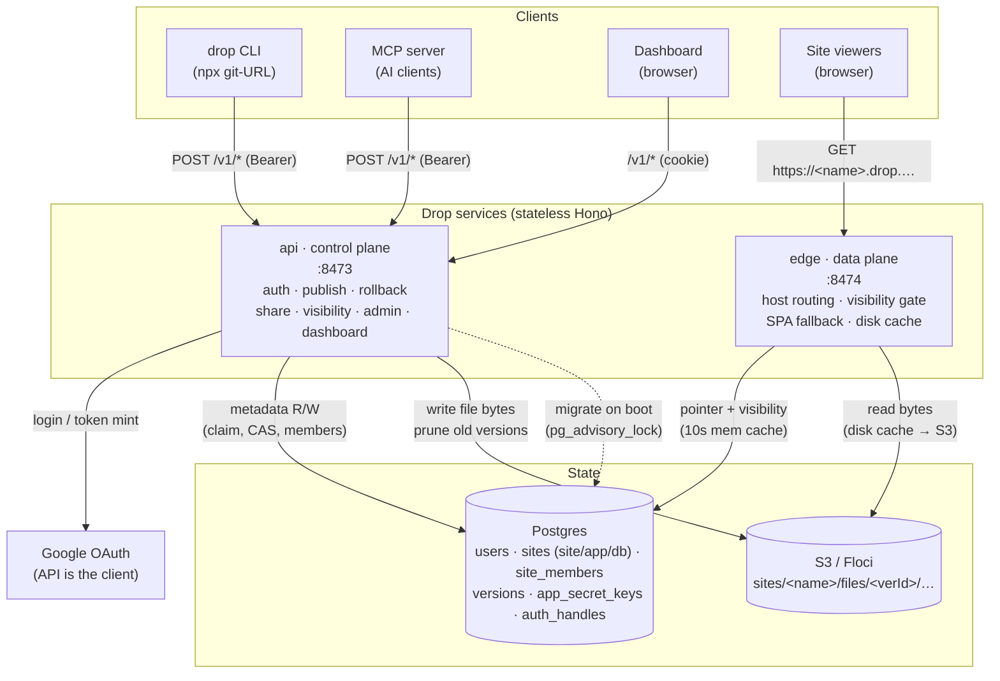
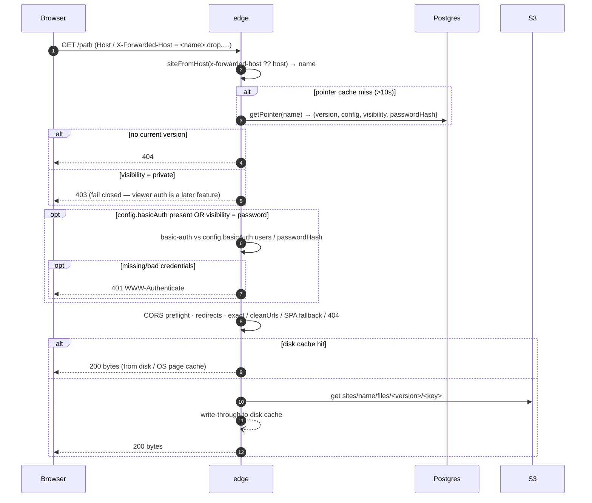
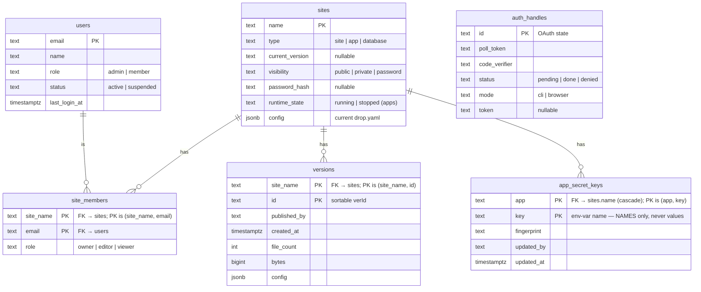
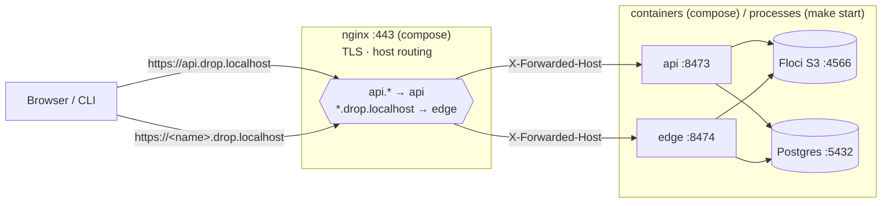
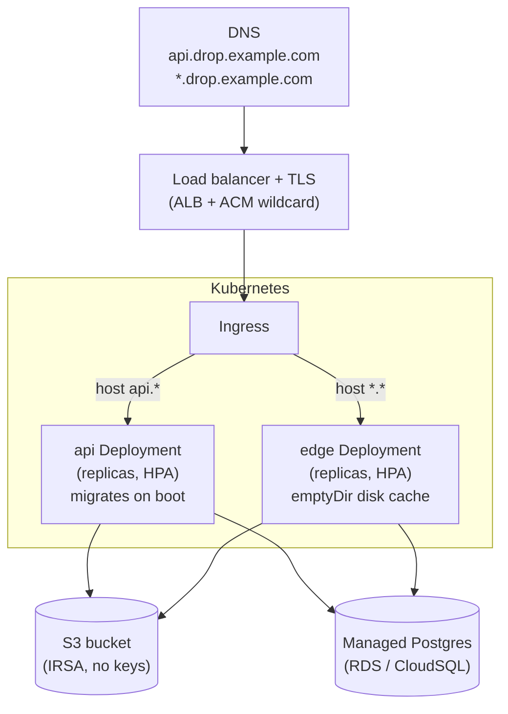
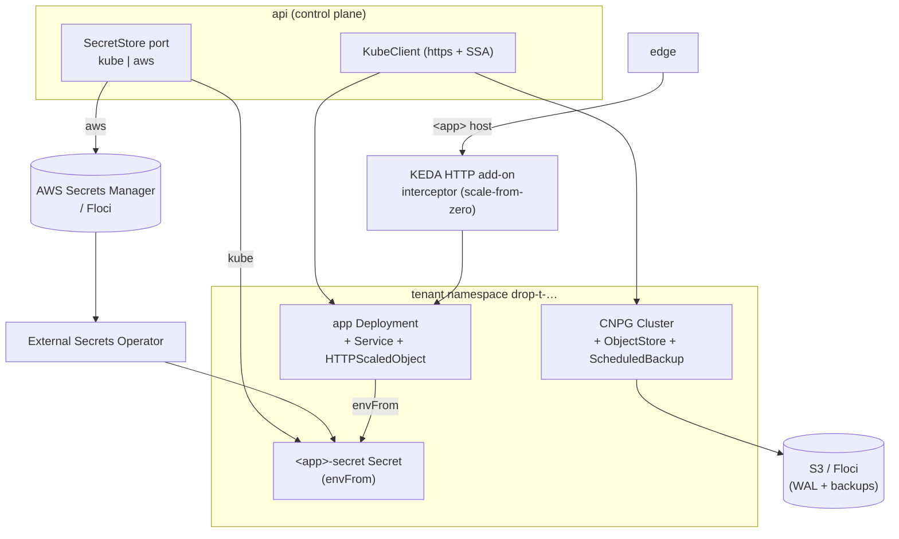

# Drop — Architecture

Drop is a self-hosted **static-site publisher** *and* an opt-in **compute platform** (container
apps + managed Postgres + secrets). Two stateless Hono services share a **Postgres** metadata
store and an **S3** byte store; the compute plane adds a **Kubernetes** cluster:

- **api** — the control plane: auth, publishing/deploy, rollback, sharing, visibility, admin, the
  dashboard, and — when compute is enabled — apps, databases, secrets, and lifecycle. Owns schema
  migrations; the only writer to Postgres and the cluster.
- **edge** — the data plane: serves published **site** bytes by hostname, and **dispatches `app`
  hostnames** to the in-cluster KEDA HTTP interceptor (scale-from-zero). Read-only against Postgres.

Static **site** bytes live in S3 (`sites/<name>/files/<verId>/…`); site/app/database **metadata**
lives in Postgres; **apps**, **databases**, and **secrets** are Kubernetes objects in per-tenant
namespaces. Compute is **opt-in** — enabled only when the api has `DROP_KUBECONFIG`; otherwise
`/v1/apps` & `/v1/databases` return `501` and Drop is static-only.

Ports: api `8473`, edge `8474`, Postgres `5432`, S3/Floci `4566` (local), nginx `443` (local
HTTPS, optional), k3s `6443` (local compute).

---

## 1. System overview

The api and edge are the only moving parts; both are horizontally scalable because
all shared state is in Postgres + S3. The edge never writes and never migrates.

---

## 2. Publish flow

`drop publish ./dist myapp` → a tarball streamed to the api, which writes bytes to
S3 and flips the live pointer in Postgres.

Atomicity: the name claim is `INSERT … ON CONFLICT DO NOTHING` (first writer wins);
the pointer flip is a row-locked transaction (replaces the old S3 ETag CAS).

---

## 3. Serve flow

A browser requests `https://<name>.drop.example.com/path`; the edge resolves the
site, enforces visibility, and streams bytes.

The long-lived in-memory cache holds only the small per-site pointer (10s TTL) —
asset **bytes** are never *retained* in memory. They're served from the node-local
disk cache (OS page cache keeps hot files at RAM speed) or fetched per-request from
S3; each object body is buffered briefly to serve the response and then freed, so
memory use is bounded by concurrency, not by site count.

---

## 4. Data model

Exactly one `owner` per site is enforced by a partial unique index
(`unique(site_name) where role='owner'`). Deleting a site cascades to its members
and versions. Authorization is two-axis: platform role (`users.role`) + per-site
role (`site_members.role`), resolved by `can(actor, action)` in
`src/authz/permissions.ts`. Visibility is an independent axis (who may *view* the
served pages) from roles (who may *manage* the site).

---

## 5. Local development topology

Two local options. **`make start`** runs api/edge as Node processes against Floci (S3)
and Postgres in podman — fast iteration over plain `http://…:<port>`. The
**`docker compose`** stack runs everything in containers behind **nginx** for trusted
HTTPS on `:443` — mirroring the prod ingress.

With `make start`, reach the edge at `http://<name>.drop.localhost:8474` and the api at
`http://localhost:8473`. With the compose stack you get `https://api.drop.localhost/`
and `https://<name>.drop.localhost/` on `:443`; nginx sets `X-Forwarded-Host`, which
the edge reads so the site name survives the proxy.

---

## 6. Production topology (Kubernetes)

Helm (`infra/helm/drop`) deploys api + edge behind one ingress. Postgres is an
**external managed** database (RDS / CloudSQL); S3 is the real bucket via IRSA.

Migrations run on api-pod boot under a `pg_advisory_lock`, so a multi-replica
rollout is safe — one pod migrates, the rest wait then serve. The edge connects
read-only and never migrates. `DROP_DATABASE_URL` is injected from a Secret into
both deployments.

---

## 7. Compute plane (apps · databases · secrets)

Opt-in (enabled by `DROP_KUBECONFIG`). The **api** is the only cluster writer; it talks to the
Kubernetes API over plain `node:https` with **server-side apply** (no `@kubernetes/client-node`),
behind a `KubeClient` port (`FakeKube` in tests). Everything a tenant owns lives in a **per-tenant
namespace** `drop-t-<slug(email)>-<hash>`, locked down by:

- **NetworkPolicy** — default-deny; egress allowlist excludes the cluster pod/service CIDRs
  (`DROP_BLOCKED_EGRESS_CIDRS`) so tenants can't reach each other or the platform DB.
- **ResourceQuota** + **LimitRange** (no unbounded pods), **PodSecurity** (baseline) labels, and
  the **gVisor** RuntimeClass for untrusted images in prod.

**Apps.** `drop deploy` → `appManifests` translates `drop.yaml` `app:` into a Deployment +
Service + **HTTPScaledObject** (KEDA HTTP add-on) + ingress NetworkPolicy. No `replicas` on the
Deployment — KEDA owns the count (0..max). The edge proxies `<name>.drop.example.com` to the KEDA
**interceptor** via `node:http` (preserving the Host header), which wakes a scaled-to-zero pod on
the first request. Lifecycle: **restart** bumps a pod-template annotation; **stop** pauses the
ScaledObject (`paused-replicas: 0`) *and* scales to 0 (true offline — won't wake on traffic);
**start** un-pauses. `runtime_state` in Postgres makes a stop survive redeploys.

**Databases.** `drop db:create` → a **CloudNativePG** `Cluster` (Postgres 18, single instance),
with backups via the **Barman Cloud Plugin** (`ObjectStore` + `ScheduledBackup`, method `plugin`)
to S3 (local Floci, prod IRSA). The app user/db are bootstrapped from a platform-owned
`<db>-app` Secret. `drop db:password` rotates the role password with a one-shot, idempotent
in-namespace `ALTER ROLE` Job (a role changes its own password — no superuser), then syncs the
Secret. Apps connect in-namespace to `<db>-rw`.

**Secrets.** Write-only per-app secrets behind a `SecretStore` **port**, backend chosen at deploy
time. **`kube`**: the api merge-patches the `<app>-secret` Secret per key (set never prunes
siblings). **`aws`**: the api writes one **AWS Secrets Manager** secret per key at
`drop/<ns>/<app>/<KEY>` and reconciles an **ExternalSecret** (explicit per-key `remoteRef`s); the
**External Secrets Operator** syncs it into `<app>-secret`. Either way the Deployment `envFrom`s
`<app>-secret` (listed after `<app>-env`, so a secret wins on a key collision; `optional` so an
absent Secret never blocks startup). The metastore holds only key **names** + a fingerprint; a
value is never returned, logged, or persisted outside the secret manager and the pod env.

**Local = prod shape.** Locally the cluster is **k3s-in-podman** with KEDA, CNPG, and ESO
installed by `make compute-up`; the `aws` secrets backend and CNPG backups run against **Floci**'s
S3 + Secrets-Manager emulation, so the local stack exercises the same code paths as EKS.
