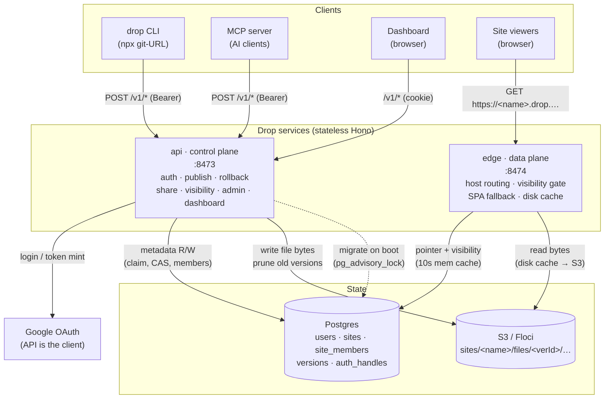
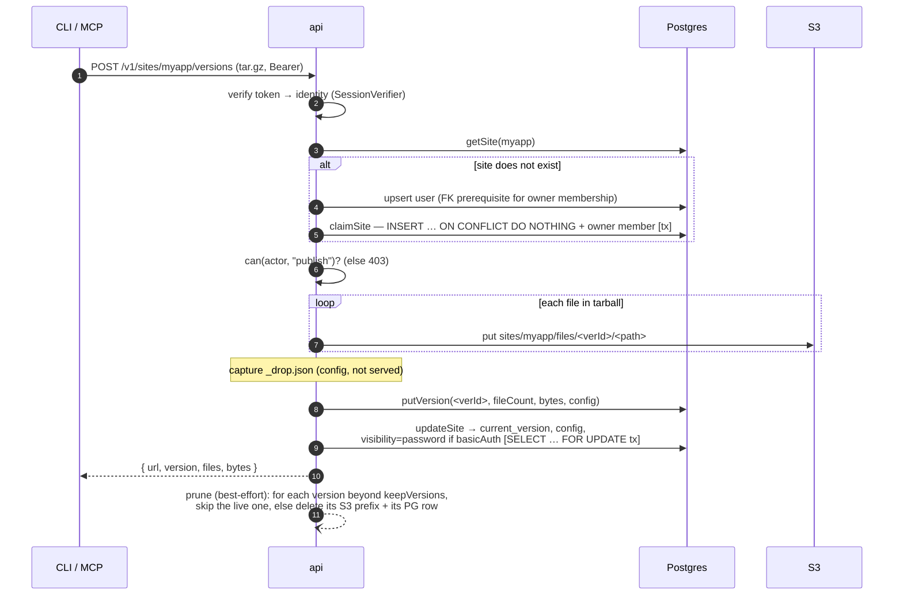
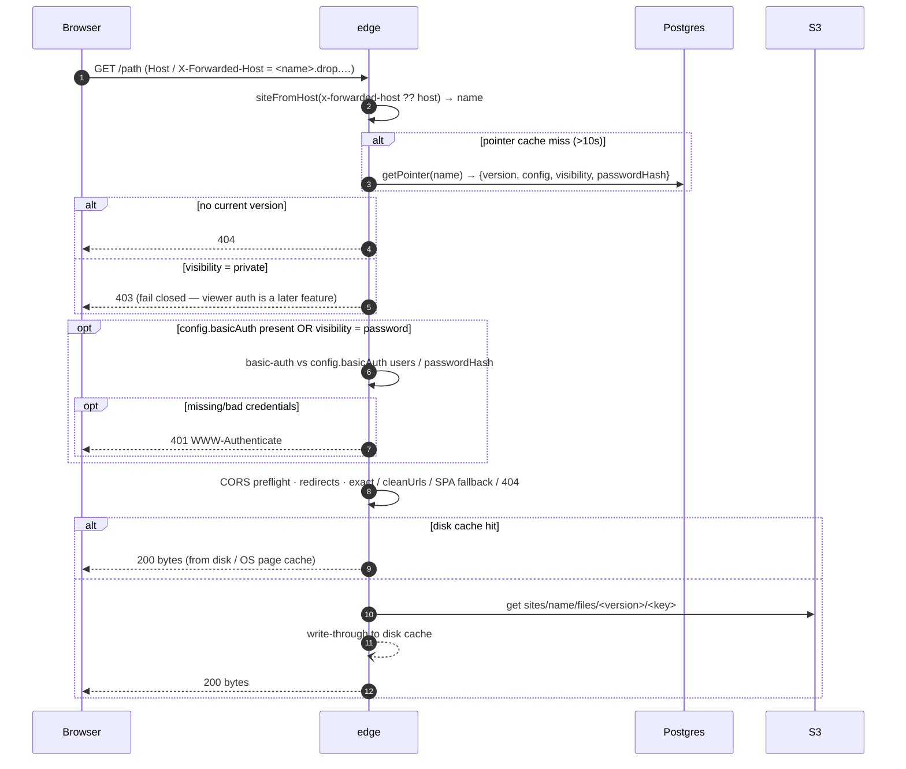
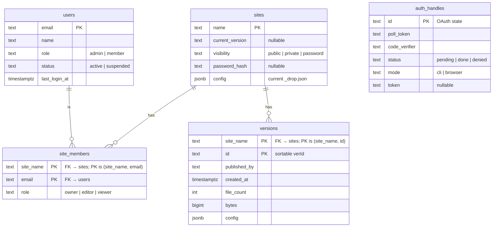
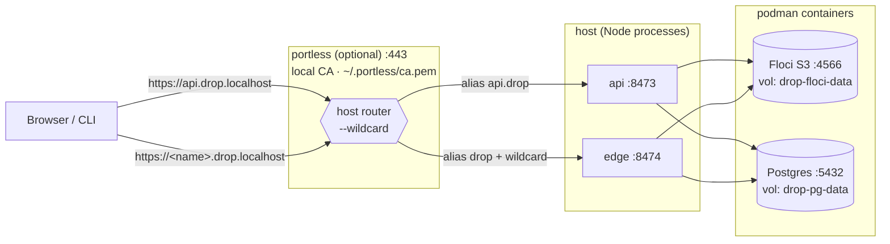
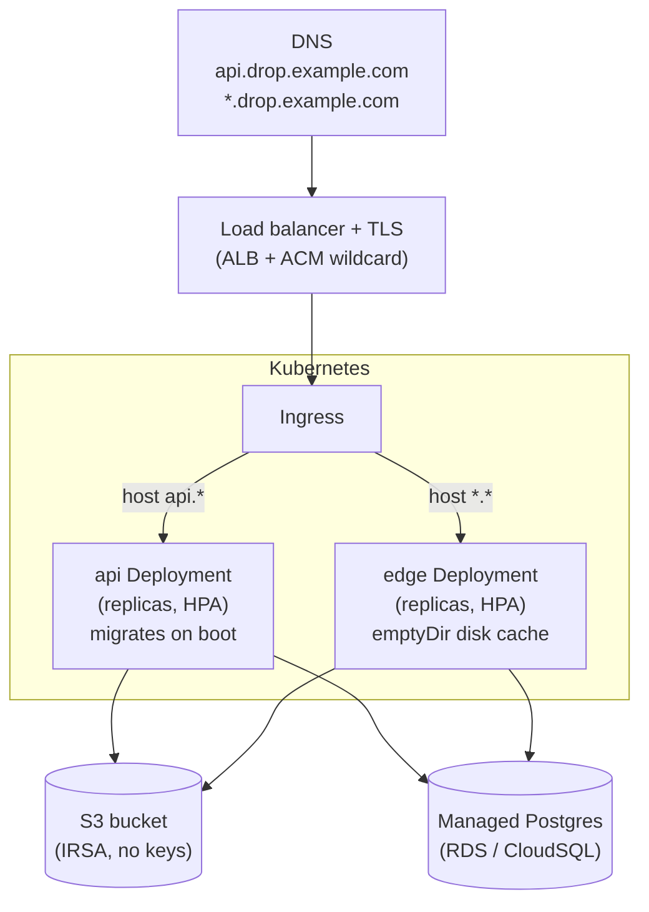

# Drop — Architecture

Drop is a self-hosted static-site publisher. Two stateless Hono services share a
**Postgres** metadata store and an **S3** (or S3-compatible) byte store:

- **api** — the control plane: auth, publishing, rollback, sharing, visibility,
  admin, and the dashboard. Owns schema migrations.
- **edge** — the data plane: serves published bytes by hostname, applies per-site
  config and visibility. Read-only against Postgres.

File **bytes** live in S3 (`sites/<name>/files/<verId>/…`). Everything else —
sites, members, versions, users, auth handles — lives in Postgres.

Ports: api `8473`, edge `8474`, Postgres `5432`, S3/Floci `4566` (local), portless
`443` (local, optional).

---

## 1. System overview

The api and edge are the only moving parts; both are horizontally scalable because
all shared state is in Postgres + S3. The edge never writes and never migrates.

---

## 2. Publish flow

`drop publish ./dist myapp` → a tarball streamed to the api, which writes bytes to
S3 and flips the live pointer in Postgres.

Atomicity: the name claim is `INSERT … ON CONFLICT DO NOTHING` (first writer wins);
the pointer flip is a row-locked transaction (replaces the old S3 ETag CAS).

---

## 3. Serve flow

A browser requests `https://<name>.drop.example.com/path`; the edge resolves the
site, enforces visibility, and streams bytes.

The long-lived in-memory cache holds only the small per-site pointer (10s TTL) —
asset **bytes** are never *retained* in memory. They're served from the node-local
disk cache (OS page cache keeps hot files at RAM speed) or fetched per-request from
S3; each object body is buffered briefly to serve the response and then freed, so
memory use is bounded by concurrency, not by site count.

---

## 4. Data model

Exactly one `owner` per site is enforced by a partial unique index
(`unique(site_name) where role='owner'`). Deleting a site cascades to its members
and versions. Authorization is two-axis: platform role (`users.role`) + per-site
role (`site_members.role`), resolved by `can(actor, action)` in
`src/authz/permissions.ts`. Visibility is an independent axis (who may *view* the
served pages) from roles (who may *manage* the site).

---

## 5. Local development topology

`make start` runs api/edge as Node processes against Floci (S3) and Postgres in
podman. `make portless` (optional) fronts them with trusted HTTPS on `:443`.

Without portless, reach the edge at `http://<name>.drop.localhost:8474` and the api
at `http://localhost:8473`. With portless you get production-shaped URLs
(`https://…`, no ports); the edge reads `x-forwarded-host` so the site name
survives the proxy.

---

## 6. Production topology (Kubernetes)

Helm (`infra/helm/drop`) deploys api + edge behind one ingress. Postgres is an
**external managed** database (RDS / CloudSQL); S3 is the real bucket via IRSA.

Migrations run on api-pod boot under a `pg_advisory_lock`, so a multi-replica
rollout is safe — one pod migrates, the rest wait then serve. The edge connects
read-only and never migrates. `DROP_DATABASE_URL` is injected from a Secret into
both deployments.
